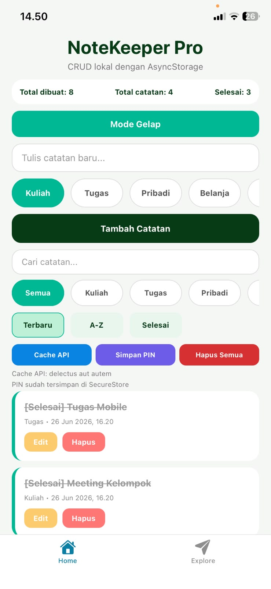
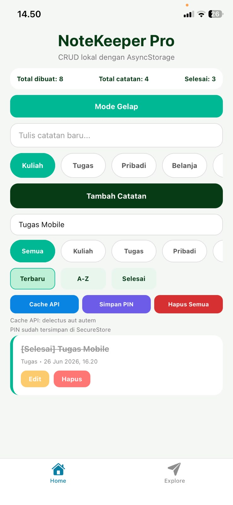
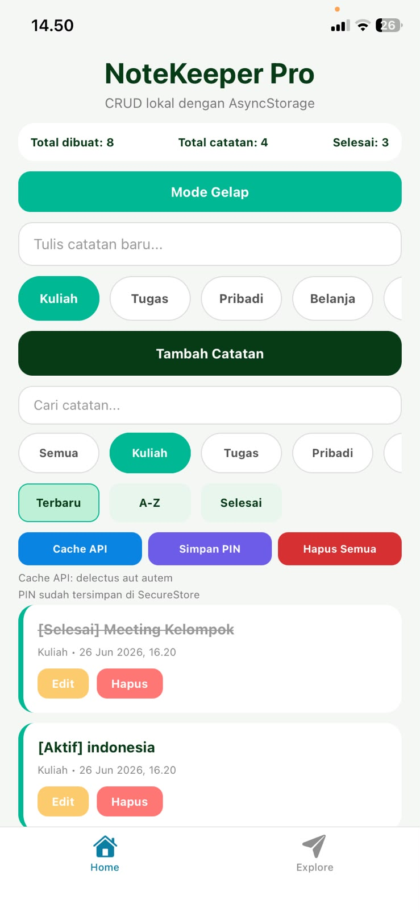
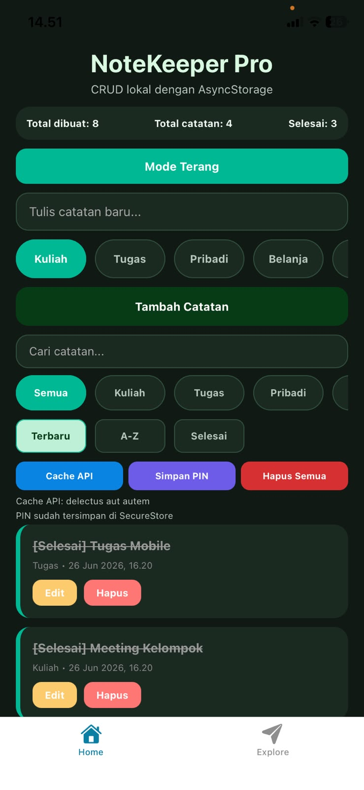
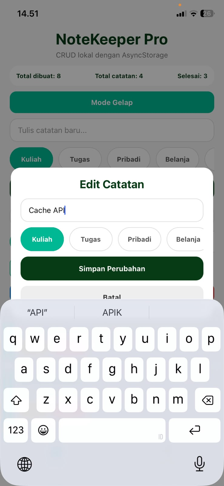
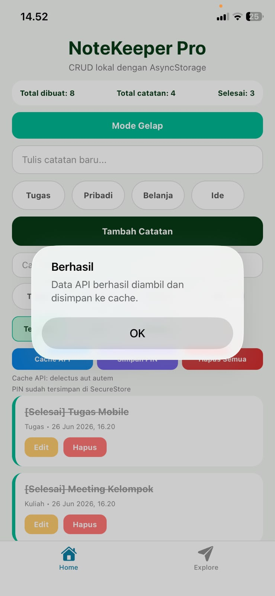

# NoteKeeper Pro

## Deskripsi Aplikasi

NoteKeeper Pro merupakan aplikasi pencatatan berbasis React Native menggunakan Expo dengan penyimpanan lokal menggunakan AsyncStorage. Aplikasi ini memungkinkan pengguna untuk menambahkan, mengedit, menghapus, mencari, serta memfilter catatan berdasarkan kategori. Seluruh data tetap tersimpan meskipun aplikasi ditutup dan dibuka kembali.

---

# Daftar Fitur

## Level 1 (Core)

- Create (Tambah Catatan)
- Read (Menampilkan Catatan)
- Update (Edit Catatan)
- Delete (Hapus Catatan)
- AsyncStorage Persistence
- FlatList
- Empty State

## Level 2 (Fitur yang Dipilih)

- Dark Mode
- Search Catatan
- Filter Berdasarkan Kategori
- Statistik Catatan
- Cache API

---

# Screenshot Aplikasi

## 1. Daftar Item



---

## 2. Search



---

## 3. Filter Kategori



---

## 4. Dark Mode



---

## 5. Edit Catatan



---

## 6. Cache API



---

## 7. Bukti Persistensi (Sebelum Aplikasi Ditutup)


---

## 8. Bukti Persistensi (Setelah Aplikasi Dibuka Kembali)


---

# Cara Menjalankan Aplikasi

Clone repository

```bash
git clone https://github.com/ruthangll/NoteKeeper-Pro.git
```

Masuk ke folder project

```bash
cd NoteKeeper-Pro
```

Install dependency

```bash
npm install
```

Jalankan aplikasi

```bash
npx expo start
```

Kemudian scan QR Code menggunakan aplikasi **Expo Go**.

---

# Tech Stack

- React Native
- Expo
- TypeScript
- AsyncStorage
- Expo SecureStore

---

# Expo Snack

Tambahkan link Expo Snack di bawah ini setelah project diunggah.

https://snack.expo.dev/

---

# GitHub Repository

https://github.com/ruthangll/NoteKeeper-Pro
